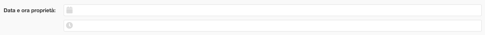
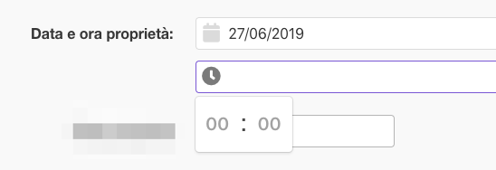
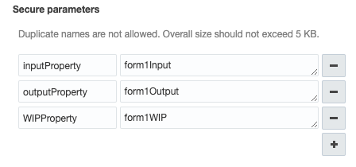

# Leadent Digital - Dynamic Forms for OFSC

## Purpose of this guide
This document describes the how to use the Dynamic Form plugin and includes the specifications for the input and output JSON documents.


## Table of Contents
<!-- @import "[TOC]" {cmd="toc" depthFrom=1 depthTo=6 orderedList=false} -->

<!-- code_chunk_output -->

- [ Leadent Digital - Dynamic Forms for OFSC](#leadent-digital-dynamic-forms-for-ofsc)
  - [ Purpose of this guide](#purpose-of-this-guide)
  - [ Table of Contents](#table-of-contents)
  - [ Introduction](#introduction)
  - [ Form Sections](#form-sections)
    - [ JSON](#json)
  - [ Fields](#fields)
    - [ Properties common to all fields](#properties-common-to-all-fields)
      - [ id - mandatory (string)](#id-mandatory-string)
      - [ label - optional (string)](#label-optional-string)
      - [ mandatory - mandatory (boolean)](#mandatory-mandatory-boolean)
    - [ Text](#text)
      - [ Configuration](#configuration)
        - [ type - mandatory (string)](#type-mandatory-string)
        - [ minLength - optional (number)](#minlength-optional-number)
        - [ maxLength - optional (number)](#maxlength-optional-number)
      - [ JSON](#json-1)
    - [ Numeric](#numeric)
      - [ Configuration](#configuration-1)
        - [ type - mandatory (string)](#type-mandatory-string-1)
        - [ minValue](#minvalue)
        - [ maxValue](#maxvalue)
      - [ JSON](#json-2)
    - [ Switch](#switch)
      - [ Configuration](#configuration-2)
        - [ type - mandatory (string)](#type-mandatory-string-2)
        - [ trueValue - mandatory (Object)](#truevalue-mandatory-object)
        - [ falseValue - mandatory (Object)](#falsevalue-mandatory-object)
      - [ defaultvalue - mandatory (string)](#defaultvalue-mandatory-string)
      - [ JSON](#json-3)
    - [ Radio](#radio)
      - [ Configuration](#configuration-3)
        - [ type - mandatory (string)](#type-mandatory-string-3)
        - [ values - mandatory (Array of objects)](#values-mandatory-array-of-objects)
      - [ JSON](#json-4)
    - [ Single Select](#single-select)
      - [ Configuration](#configuration-4)
        - [ type - mandatory (string)](#type-mandatory-string-4)
        - [ values - mandatory (Array of objects)](#values-mandatory-array-of-objects-1)
      - [ JSON](#json-5)
    - [ Multi Select](#multi-select)
      - [ Configuration](#configuration-5)
        - [ type - mandatory (string)](#type-mandatory-string-5)
        - [ values - mandatory (Array of objects)](#values-mandatory-array-of-objects-2)
      - [ JSON](#json-6)
    - [ Datetime](#datetime)
      - [ Configuration](#configuration-6)
        - [ type - mandatory (string)](#type-mandatory-string-6)
        - [ placeholderDateText (optional)](#placeholderdatetext-optional)
        - [ placeholderTimeText (optional)](#placeholdertimetext-optional)
      - [ JSON](#json-7)
    - [ Date](#date)
      - [ Configuration](#configuration-7)
        - [ type - mandatory (string)](#type-mandatory-string-7)
        - [ placeholderDateText (optional)](#placeholderdatetext-optional-1)
      - [ JSON](#json-8)
  - [ JSON Output](#json-output)
  - [ OFSC Configuration](#ofsc-configuration)
    - [ Multiple forms](#multiple-forms)
  - [ Integration with upstream systems](#integration-with-upstream-systems)
    - [ Inbound](#inbound)
    - [ Outbound](#outbound)
  - [ Copyright Leadent Digital 2019, all rights reserved](#copyright-leadent-digital-2019-all-rights-reserved)

<!-- /code_chunk_output -->


## Introduction
The plugin provides a dynamically rendered, responsive form based on a supplied input JSON document.  The input JSON document contains the sections that are to be included in the document and the form fields that are to be included in each section
Each section has a label that is displayed and each field also has a label.  In addition, for the form fields, there are a number of other properties that can be specified that depend upon the field type that dictate what's displayed and what validation should be applied.  The details of each of these is described in the following sections.

The majority of the images in this guide show the form rendered on a desktop but the form will dynamically adapt to smartphone and tablet screen formats

## Form Sections
Form sections are used to divide a form into groups of fields and each section has a label.  There can be multiple sections within a form


<p align="center">
<i>The enclosed red area constitutes one section</i>
</p>

### JSON
The root level of the input JSON is an array of sections
Each section **must** have a type of "section"
Each section **must** have a unique ID value

Sections are displayed in the order in which they're specified in the input JSON

```
[{
    "type": "section",
    "label": "SECTION1",
    "id": "S1",
    "fields": [
      ...
    ]
},
{
    "type": "section",
    "label": "SECTION2",
    "id": "S2",
    "fields": [
      ...
    ]
}]
```

Within a section specific fields are specified using the fields array property, described below.

## Fields
The following field types are available to use:

* Text
* Numeric
* Switch
* Radio
* Single select
* Multi select
* Datetime
* Date only

Each field has an ID property.  **This ID must be unique within its section**

Fields will be displayed in the order in which they are supplied within their parent section

### Properties common to all fields
All fields have the following properties:

#### id - mandatory (string)
The id of the field which will be used to specify the field in the output JSON after completion by the user.  **This must be unique within the parent section**
Mandatory fields will have their labels prefixed with * as a tip to the user

#### label - optional (string)
The label to display for the field - "Numero di pompe 1" in the image above.  Note that a colon is automatically appended to the end of the string so it doesn't need to be provided

#### mandatory - mandatory (boolean)
This will enforce that the field must have a value before submission


### Text
The text input field is used to capture the regular text input and looks like this:


#### Configuration
The Text input field has the following additional configuration options available:

##### type - mandatory (string)
Set to "text" to specify that this is a text input field

##### minLength - optional (number)
This will enforce that the field must have the specified minimum number of characters

##### maxLength - optional (number)
This will enforce that the field cannot exceed the specified maximum number of characters

#### JSON
The JSON for a Text input field looks like this:

```
{
  "type": "text",
  "id": "QT1",
  "label": "Modello Pompa",
  "mandatory": false,
  "minLength": 3,
  "maxLength": 6
}
```

### Numeric
The Numeric input field is used to capture the numeric values and looks like this:


A numeric keypad will be enforced and there are also increment/decrement buttons to change the value.

#### Configuration
The Numeric input field has the following additional configuration options available:

##### type - mandatory (string)
Set to "numeric" to specify that this is a numeric input field

##### minValue
This will enforce that the field must be greater than than specified number

##### maxValue
This will enforce that the field must be less than than specified number

#### JSON
The JSON for a Text input field looks like this:

```
{
  "type": "numeric",
  "id": "QN1",
  "label": "Numero di pompe 1",
  "mandatory": false,
  "minValue": 1,
  "maxValue": 10
}
```

### Switch
The Switch input field is used to capture a value where there only two options available, one of which is specified by default.  The following two images show a switch in both states:


#### Configuration

##### type - mandatory (string)
Set to "switch" to specify that this is a Switch input field

The Switch input field has the following additional configuration options available:

##### trueValue - mandatory (Object)
The trueValue field represents the value for the switch when it is turned _on_.  It is an object with two keys:
* __text (string)__
The value displayed to the user when selected
* __value (string)__
The value that is returned in the output JSON

##### falseValue - mandatory (Object)
The falseValue field represents the value for the switch when it is turned _off_.  It is an object with two keys:
* __text (string)__
The value displayed to the user when selected
* __value (string)__
The value that is returned in the output JSON

#### defaultvalue - mandatory (string)
A swtich field must always have a value, The default value field specifies the value that is selected by default and must match the value of one of the value keys specified for trueValue or falseValue

#### JSON
The JSON for a Switch input field looks like this:

```
{
  "type": "switch",
  "id": "QS1",
  "label": "Interruttore",
  "mandatory": true,
  "trueValue": {
    "text": "Sì",
    "value": "sì"
  },
  "falseValue": {
    "text": "No",
    "value": "no"
  },
  "defaultValue": "no"
}
```

### Radio
The Radio input field is used to capture a single value where there are multiple options available, presented as radio buttons.


#### Configuration

##### type - mandatory (string)
Set to "radio" to specify that this is a Radio input field

The Radio input field has the following additional configuration options available:

##### values - mandatory (Array of objects)
Each option/radio to show to the user is specified as an object within an array.  Radio options are shown in the order in which they are specified in the array.
Each object is specified as:

* __text (string)__
The value displayed to the user when selected
* __value (string)__
The value that is returned in the output JSON

#### JSON

```
{
  "type": "radio",
  "id": "QR1",
  "label": "ProtezioniCarter",
  "mandatory": true,
  "values": [{
      "text": "Sì",
      "value": "Sì"
    },
    {
      "text": "No",
      "value": "No"
    },
    {
      "text": "Integri",
      "value": "Integri"
    },
    {
      "text": "Danneggiati",
      "value": "Danneggiati"
    }
  ]
}
```

### Single Select
The Single Select input field is used to capture a single value where there are multiple options available, presented as a dropdown list.


#### Configuration

##### type - mandatory (string)
Set to "singleselect" to specify that this is a Single Select input field

The Single Select input field has the following additional configuration options available:

##### values - mandatory (Array of objects)
Each option to show to the user is specified as an object within an array.  Options are shown in the order in which they are specified in the array.
Each object is specified as:

* __text (string)__
The value displayed to the user when selected
* __value (string)__
The value that is returned in the output JSON

#### JSON

```
{
  "type": "singleselect",
  "id": "QSS1",
  "label": "Olio camera tenute:",
  "mandatory": false,
  "values": [{
      "text": "Buono",
      "value": "olio_1"
    },
    {
      "text": "Emulsionato",
      "value": "olio_2"
    },
    {
      "text": "Sostituito",
      "value": "olio_3"
    }
  ]
}
```


### Multi Select
The Multi Select input field is used to capture multiple values where there are multiple options available, presented as a checkboxes.


#### Configuration

##### type - mandatory (string)
Set to "multiselect" to specify that this is a Multi Select input field

The Multi Select input field has the following additional configuration options available:

##### values - mandatory (Array of objects)
Each checkbox to show to the user is specified as an object within an array.  Checkboxes are shown in the order in which they are specified in the array.
Each object is specified as:

* __text (string)__
The value displayed to the user when selected
* __value (string)__
The value that is returned in the output JSON

#### JSON

```
{
  "type": "multiselect",
  "id": "QMS1",
  "label": "Macchina",
  "mandatory": false,
  "values": [{
      "text": "Monovite",
      "value": "macchina_1"
    },
    {
      "text": "Vougan",
      "value": "macchina_2"
    },
    {
      "text": "Centrifuga",
      "value": "macchina_3"
    }
  ]
}
```

### Datetime
The Datetime input field is used to capture a Date and Time using date and time pickers.  The current date is highlighted in the date picker.


**_Before selection_**


**_Selecting a date_**


**_Selecting a time_**


**_Completed field_**


#### Configuration

##### type - mandatory (string)
Set to "datetime" to specify that this is a Date Time input field

The Datetime input field has the following additional configuration options available:

##### placeholderDateText (optional)
The placeholder text to display within the date field prior to the user entering any text

##### placeholderTimeText (optional)
The placeholder text to display within the time field prior to the user entering any text

#### JSON

```
{
  "type": "datetime",
  "id": "QDT1",
  "label": "Data e ora proprietà",
  "mandatory": false,
  "placeholderDateText": "Seleziona una data",
  "placeholderTimeText": "Clicca per selezionare"
}
```

### Date
The Date input field is used to capture a Date using a date pickers.  The current date is highlighted in the date picker.


**_Before selection_**


**_Selecting a date_**


**_Completed field_**


#### Configuration

##### type - mandatory (string)
Set to "dateonly" to specify that this is a Date input field

The Date input has the following additional configuration options available:

##### placeholderDateText (optional)
The placeholder text to display within the field prior to the user entering any text

#### JSON

```
{
  "type": "dateonly",
  "id": "QD1",
  "label": "Data proprietà",
  "mandatory": false,
  "placeholderDateText": "Seleziona una data"
}
```


## JSON Output

When the user saves a form the values that were entered are consolidated into a JSON output document

The JSON output document is an object with a section property containing an array of section objects.  Each section object represents a section for which the user provided a value for a field and contains the section ID and a fields property.

Within each section the fields property holds an array of objects that each represents the values entered by the user and the ID of the field

For example the following output JSON corresponds to the form shown below:


**_User entered data_**


```
{
  "sections": [
    {
      "id": "S2",
      "fields": [
        {
          "id": "QS1",
          "value": "no"
        },
        {
          "id": "QS2",
          "value": "sì"
        }
      ]
    },
    {
      "id": "S1",
      "fields": [
        {
          "id": "QR1",
          "value": "Sì"
        },
        {
          "id": "QR2",
          "value": "No"
        },
        {
          "id": "QSS1",
          "value": "olio_2"
        },
        {
          "id": "QMS1",
          "value": [
            "macchina_2",
            "macchina_3"
          ]
        },
        {
          "id": "QN1",
          "value": 4
        },
        {
          "id": "QT1",
          "value": "Avalue"
        },
        {
          "id": "QDT1",
          "value": "2019-06-26T06:02:00.000Z"
        }
      ]
    }
  ]
}
```

Where multiple options are available for selection - i.e. on multiselect, an array of values is returned.  E.g.

```
{
  "id": "QMS1",
  "value": [
    "macchina_2",
    "macchina_3"
  ]
}
```

## OFSC Configuration

The Dynamic Form plugin uses the OFSC Plugin API and is configured using the standard OFSC Forms & Plugins capability within the Configuration tool.

For a form, two OFSC Activity properties of type String/Text must be created.

The plugin configuration requires that two secure parameters are defined:
* __inputProperty__ tells the plugin which activity property to retrieve the form definition JSON from
* __outputProperty__ tells the plugin which activity property to write the form results JSON to
* __WIPProperty__ tells the plugin which activity property to write the value for a work-in-progress (not complete) form to


**_OFSC Plugin Secure Parameters_**

The plugin must also be configured such that activityId (aid), the inputProperty and outputProperty properties are passed to the plugin at runtime:


**_OFSC Plugin Available Properties_**

The plugin is then placed on a form using the standard OFSC screen designer configuration.

### Multiple forms
The Dynamic Form plugin can also be configured multiple times if multiple forms are required on the same activity.  Multiple forms are distinguished by the inputProperty and outputProperty therefore separate activity input and output properties must be created for each form

## Integration with upstream systems
### Inbound
As defined in this guide, the OFSC property specified in the inputProperty property must be specified as JSON on activity creation in order to tell the plugin what needs to be rendered in the form.  Depending on the tool used to create activities in OFSC, this JSON will need to be escaped so that it can be treated as a string on the Create Activity ReST API call.

### Outbound
As defined in this guide, the OFSC property specified in the outputProperty property will be written to with the results of the user's interaction with the form.  The user has the option to save their in-progress work on the form prior completion without invoking the validation of mandatory fields.  Only on final completion of the form will full validation be applied.  The final results are saved to the property defined by _outputProperty_.  If the completion of a form is necessary for the completion of an activity, a visibilty rule within OFSC can be applied that hides/displays the activity completion button based on the presence of data (is not empty) in _outputProperty_

## Copyright Leadent Digital 2019, all rights reserved
